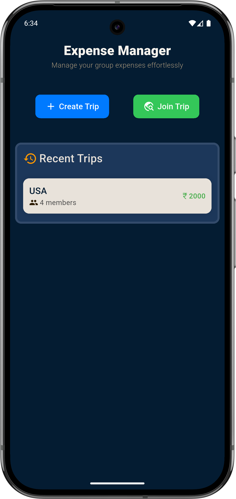
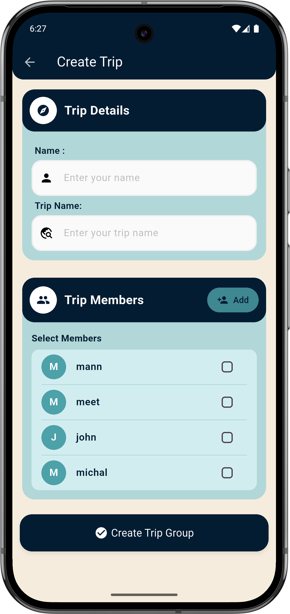
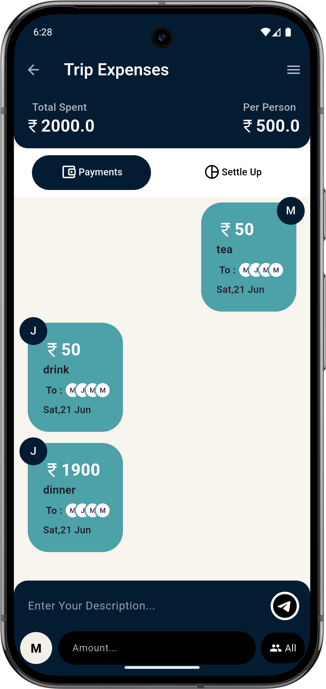
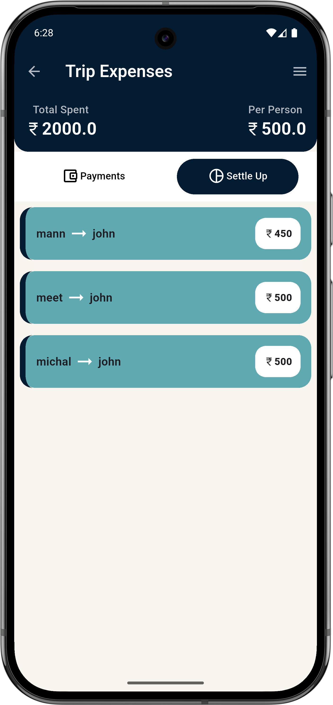

# Trip Expense Manager

A Flutter app to manage and split group expenses during trips. Add your expenses, track who paid, and see who owes how much — all in one place.

## Getting Started

## ✨ Features

- Create or join a trip group
- Add expenses with amount and description
- Auto-calculates expense split between members
- Shows detailed who-pays-whom breakdown
- Displays recent trips and summaries
- Real-time collaboration

## 🚧 Work in Progress

I am actively working on this project to add more functionality and polish:

- Google Pay integration for settling up
- Push notifications for new expenses or settlements
- State management with **GetX** for better performance and scalability
- UI improvements and optimization

Stay tuned for updates!

| Recent Trips | Join Trip |Create Trip |
|-----------|---------------|-------------|
|  |  |  |

| Expenses List                                     | Settlements | 
|---------------------------------------------------|-------------|
|  |  |

---
